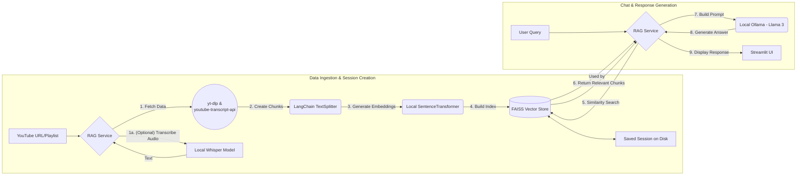

# Youtubot: A Private, Local, & Multilingual YouTube AI Assistant

<p align="center">
  
</p>

An advanced, private, and multilingual AI assistant that provides intelligent responses using the content of YouTube videos and playlists. This version runs its core AI logic (language understanding and generation) entirely on your local machine, ensuring complete privacy with no reliance on paid APIs.

Built with a modern, on-demand RAG (Retrieval-Augmented Generation) architecture, it leverages powerful open-source models and can build, save, and load entire knowledge bases from YouTube content.

## Key Features

### 🚀 Mostly Local & 100% Private Core AI
- **Zero API Keys for AI**: The core RAG pipeline runs without requiring any paid services from OpenAI or Google for embeddings and language generation.
- **Complete Privacy**: Your data, video transcripts, and queries never leave your local machine. The AI logic is fully contained.
- **Offline Capable AI**: Once models are downloaded, the core application can run without an internet connection.

### 🧠 Advanced RAG System
- **Process Any Video**: Uses OpenAI's Whisper to locally transcribe videos, allowing you to chat with content that has no pre-existing subtitles.
- **Process Entire Playlists**: Ingest knowledge from a whole YouTube playlist in one go.
- **Intelligent Local Retrieval**: Performs semantic search using a state-of-the-art multilingual embedding model running locally.

### 📚 Knowledge Base Persistence
- **Save & Load Sessions**: Save the processed video index (vector store and metadata) to your local disk under a unique session name.
- **Instant Resume**: Load any saved session instantly to start asking questions without needing to re-process videos.
- **Temporary Sessions**: Choose to have a "one-off" chat without saving the session to disk.
- **Session Management**: Easily delete old or unneeded sessions directly from the UI.

### 🌎 Multilingual by Design
- **Consistent Language Context**: The AI will always respond in the language of the source video, creating an intuitive and consistent experience.
- **Response Language Override**: Force the AI to answer in a specific language (e.g., English, Spanish, Turkish) on-the-fly from a dropdown in the chat interface.

### 🔊 Online Text-to-Speech
- **Reliable Voice Synthesis**: Integrates Google's public TTS service (`gTTS`) to generate clear audio for responses.
- **Note**: This is the only feature that requires an active internet connection.

## Architecture

Our architecture uses the most robust and reliable open-source tools for each step of the process.



## Technology Stack

### Core Technologies
- **Python 3.11**: Main programming language.
- **Streamlit**: Interactive web application framework.
- **uv**: High-speed Python package installer.
- **Ollama**: Runs large language models like Llama 3 locally.
- **LangChain**: The core framework for orchestrating the RAG pipeline.
- **FAISS**: Ultra-fast, in-memory vector store.
- **Docker & Docker Compose**: For containerized deployment.

### AI & ML (100% Local)
- **OpenAI Whisper**: State-of-the-art speech-to-text model for local transcription.
- **Sentence Transformers**: State-of-the-art multilingual embedding models.

### Data Processing & Tools
- **yt-dlp & FFmpeg**: Industry-standard tools for fetching and processing video/audio.
- **youtube-transcript-api**: Robust library for fetching YouTube caption files.
- **gTTS**: Google's public Text-to-Speech library.
- **PyYAML**: For managing configuration.

---

## 🚀 Getting Started

This guide focuses on running the application locally.

### 1. System Prerequisites (Crucial First Step!)
This is a one-time setup for your computer to ensure all tools and libraries can be installed correctly.

#### 1.1 - Python
- Ensure you have Python **3.11** installed. Other versions may cause issues.

#### 1.2 - Build Tools & FFmpeg
Many Python AI libraries need to be compiled from source, and Whisper requires FFmpeg to process audio.

-   **On Windows:**
    1.  **C++ Build Tools**: You **must** install the [Microsoft C++ Build Tools](https://visualstudio.microsoft.com/visual-cpp-build-tools/). When the installer runs, select the **"Desktop development with C++"** workload and click Install.
    2.  **FFmpeg (Manual Install)**:
        *   Go to [https://www.gyan.dev/ffmpeg/builds/](https://www.gyan.dev/ffmpeg/builds/).
        *   Scroll down to the **"release builds"** section and download the `ffmpeg-release-full.7z` file.
        *   Extract the `.7z` file. You will get a folder named like `ffmpeg-7.0-full_build`. The `bin` folder is **inside** this one.
        *   Rename this main folder to just `ffmpeg` and move it to the root of your `C:\` drive. The final path should be `C:\ffmpeg\bin`.
        *   Now, add this to your Windows Path:
            1.  Press the Windows Key, type `env`, and click "Edit the system environment variables".
            2.  Click the "Environment Variables..." button.
            3.  In the "System variables" (bottom box), find and double-click the variable named **Path**. **Do not create a new variable.**
            4.  Click "New" and add the exact path: `C:\ffmpeg\bin`
            5.  Click OK on all windows to save.

-   **On macOS:**
    *   You will need Homebrew. Install it if you don't have it.
    *   Run `brew install ffmpeg` in your terminal.

-   **On Linux (Debian/Ubuntu):**
    *   Run `sudo apt update && sudo apt install build-essential ffmpeg` in your terminal.

#### 1.3 - Ollama & LLM Model
1.  **Install Ollama**: Go to [ollama.com](https://ollama.com/) and download/install the application for your OS.
2.  **Start Ollama & Download the LLM**:
    *   Ensure the Ollama application is running in the background.
    *   Open a **new, separate terminal** and run: `ollama run llama3`
    *   Wait for the download to complete. Once you see a `>>>` prompt, the server is ready. You can close this terminal.

### 2. Project Setup
```bash
# Clone the repository
git clone https://github.com/kaansen97/youtubot.git
cd youtubot

# Install uv (if you don't have it)
pip install uv

# Create and activate a virtual environment
uv sync
source .venv/bin/activate  # On Windows: .venv\Scripts\activate
```

### 3. Run the Application
Make sure the Ollama application is still running. Then, from your activated `(.venv)` terminal, start the Streamlit app:
```bash
streamlit run app.py
```
Youtubot will be available at `http://localhost:8501`.

## Usage: Session Management
Youtubot operates on "sessions," which are knowledge bases built from YouTube content.

### Starting a New Chat
1.  From the main screen, select **"Start a New Chat"**.
2.  Choose whether you are providing a **"Single Video URL"** or a **"Playlist URL"**.
3.  Paste the URL and select the primary language.
4.  **(Optional)** Check "Use local Whisper transcription" for videos without subtitles. This is much slower.
5.  **(Optional)** Check "Save this session for later?" and provide a name if you wish to persist this knowledge base.
6.  Click **"Start Chatting"**.

### Loading an Existing Session
1.  From the main screen, select **"Load Saved Session"**.
2.  A dropdown will appear with all your previously saved session names.
3.  Select the one you want to work with and click **"Load Session"**.
4.  You can also delete sessions from this screen.

## Acknowledgments
This project was originally forked from the excellent [youtube-rag-assistant](https://github.com/ezgisubasi/youtube-rag-assistant) repository by [ezgisubasi](https://github.com/ezgisubasi). It has since been significantly refactored and enhanced with a more robust data ingestion pipeline (yt-dlp, Whisper), playlist processing, knowledge base persistence, and an expanded user interface.

This project also stands on the shoulders of giants in the open-source community:
- **Ollama**: For making it incredibly simple to run powerful LLMs locally.
- **OpenAI**: For the open-source Whisper model.
- **The developers of yt-dlp and youtube-transcript-api**: For maintaining the essential tools for accessing YouTube data.
- **LangChain & Streamlit**: For the powerful frameworks that make building AI apps accessible.